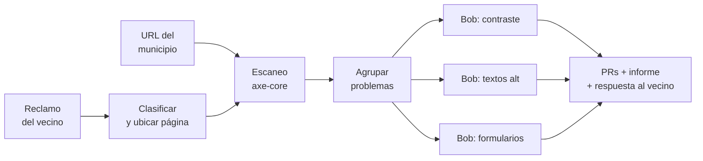

# Plan hackatón IBM Bob — Auditor de accesibilidad

Sep 23, 2026 · @cande

## La idea

**Un vecino reporta "no puedo usar este trámite" (o el municipio pasa la URL de su sitio), y en minutos hay un diagnóstico de accesibilidad y los arreglos de código listos como Pull Requests, generados en paralelo por Bob.** Nombre de trabajo: **Rampa** (una rampa digital para los sitios del Estado).

- **El problema:** muchas personas con discapacidad visual, motriz o cognitiva no pueden hacer trámites online porque los sitios públicos no cumplen las pautas de accesibilidad (WCAG). Cuando se quejan, el reclamo se pierde; y arreglar a mano es lento porque los equipos de gobierno son chicos.
- **Dos disparadores, una automatización:**
  - **Reactivo:** el reclamo de un vecino se clasifica solo, se ubica la página con el problema y se escanea.
  - **Proactivo:** el municipio escanea su sitio completo antes de que alguien se queje.
- **Por qué gana:**
  - Encaja con el lema *"AI running your parallel workflows"*: un agente de Bob por cada problema, trabajando a la vez.
  - Conecta al ciudadano con el código: la queja se convierte en un arreglo, no en un expediente.
  - La demo es visual (antes y después) y le habla al cliente típico de IBM, que son los gobiernos.

## Cómo funciona

La automatización tiene dos puertas de entrada que confluyen en el mismo motor. La clave para el jurado es que los arreglos se hacen **en paralelo**.

1. **Entrada:** un reclamo en lenguaje común ("el formulario de turnos no me deja enviar, uso lector de pantalla") o la URL del sitio. Para la demo usamos un portal municipal de prueba propio.
2. **Clasificación (solo si es reclamo):** la IA entiende el reclamo, detecta que es un problema de accesibilidad y ubica la página afectada.
3. **Escaneo:** axe-core revisa la página (o todo el sitio) y lista cada problema con su regla WCAG.
4. **Arreglos en paralelo:** se agrupan los problemas por tipo y Bob trabaja cada grupo a la vez: textos alternativos, colores con poco contraste y formularios sin etiqueta.
5. **Verificación:** se vuelve a escanear para confirmar que el problema desapareció.
6. **Salida:** un Pull Request por grupo, un informe con puntaje antes y después, y **una respuesta automática al vecino** avisando que su reclamo generó un arreglo.

## Alcance del MVP

En 48 horas hay que mostrar **un flujo completo que funcione de punta a punta**, aunque sea chico, antes que muchas funciones a medias.

| Entra en el MVP | Queda para después |
| --- | --- |
| Un sitio de demo propio con 10–15 errores de accesibilidad puestos a propósito | Escanear cualquier sitio real de internet |
| 3 tipos de problema: contraste, imágenes sin texto alternativo, formularios sin etiqueta | Las más de 50 reglas WCAG |
| Arreglos en paralelo con Bob y un PR por tipo | Arreglos automáticos sin revisión humana |
| Informe con puntaje antes y después | Panel de seguimiento para muchos sitios |
| Una pantalla simple: pegar URL → ver progreso → ver resultados | Cuentas de usuario y login |
| Formulario simple de reclamo + clasificación con IA de 3–4 reclamos de ejemplo | Conexión con sistemas reales de reclamos (147, WhatsApp municipal) |

**Por qué un sitio de demo propio:** no podemos abrir PRs en el repositorio de un municipio real, y así controlamos qué errores aparecen. En el pitch mostramos además el escaneo (solo lectura) de un sitio público real para dar contexto.

## Stack técnico

Herramientas simples y conocidas, para gastar el tiempo en la automatización y no en configurar cosas.

| Parte | Herramienta | Para qué |
| --- | --- | --- |
| Agente de código | **IBM Bob** | Leer el repo, escribir los arreglos y trabajar en paralelo (obligatorio) |
| Auditoría | **axe-core** + Playwright | Recorrer las páginas y detectar errores WCAG |
| Orquestación | Script en Node.js o Python | Encadenar escaneo → Bob → verificación → PR |
| Repositorio | GitHub | Alojar el sitio de demo y recibir los PRs |
| Interfaz | Una página web simple (React o HTML) | Pegar URL y ver el progreso |
| Sitio de demo | HTML/CSS que imita un portal municipal de trámites | El "paciente" que arreglamos en vivo |

**A confirmar en el Discord:** si Bob se puede llamar desde un script o solo desde su editor. Si es solo desde el editor, el paralelismo se muestra abriendo varias tareas de Bob a la vez.

## Roles del equipo

Dividimos por lo que cada uno hace mejor. A ajustar cuando sepamos el perfil del compañero.

| Quién | Se encarga de |
| --- | --- |
| **Cande** | Producto y pitch: el problema, la historia, el sitio de demo con errores, la interfaz, el informe final, el video y la presentación. También probar el flujo como usuaria |
| **Compañero** | Motor técnico: escaneo con axe-core, orquestación, integración con Bob y creación de los PRs |
| **Los dos** | Decidir el alcance el viernes, probar juntos el sábado a la noche, ensayar la demo |

## Plan de las 48 horas

Regla de oro: **el sábado a la noche tiene que andar el flujo completo, aunque sea feo.** El domingo es para pulir y grabar, no para construir.

| Momento | Cande | Compañero | Meta al terminar |
| --- | --- | --- | --- |
| **Viernes (inicio)** | Ver el kickoff, leer criterios, cerrar alcance | Configurar Bob, repo y axe-core | Repo creado, Bob andando |
| **Viernes (noche)** | Armar el sitio de demo con 10–15 errores | Script que escanea el sitio y lista errores | Escaneo funcionando sobre el sitio de demo |
| **Sábado (mañana)** | Diseñar la interfaz: pegar URL → progreso → resultados | Primer arreglo automático con Bob (un tipo de error) | Un error arreglado de punta a punta |
| **Sábado (tarde)** | Conectar la interfaz con el motor; escribir el informe | Paralelizar los 3 tipos y crear los PRs | Flujo completo con 3 tipos en paralelo |
| **Sábado (noche)** | Probar todo como usuaria, anotar errores | Corregir errores | **Demo estable** |
| **Domingo (mañana)** | Guion del pitch y slides | Verificación con re-escaneo y puntaje antes/después | Pitch escrito |
| **Domingo (tarde)** | Grabar el video demo | README y limpieza del repo | **Entrega enviada con 2–3 horas de margen** |

Si algo se traba más de 1 hora, se recorta: mejor 2 tipos de error que funcionan que 3 que fallan.

## Pitch y demo

El pitch cuenta una historia; la demo la prueba. Estructura de unos 3 minutos:

1. **Problema (30 s):** "María es ciega y quiere sacar un turno en su municipio. El formulario no funciona con su lector de pantalla. Se queja, y su reclamo se pierde. Como ella, millones de personas quedan afuera de trámites que deberían ser para todos."
2. **Por qué pasa (20 s):** los equipos de gobierno son chicos, los sitios son viejos y los reclamos no llegan a quien programa.
3. **Solución (20 s):** "Rampa: el reclamo de María se convierte en código arreglado."
4. **Demo en vivo (90 s):** María escribe su reclamo → el sistema lo clasifica y ubica la página → los agentes de Bob arreglan en paralelo → se abre el PR → sitio antes y después con puntaje → María recibe la respuesta "tu reclamo generó un arreglo".
5. **Impacto y futuro (20 s):** el mismo motor escanea sitios completos antes de que alguien se queje, y escala a cientos de municipios.

**Frase para cerrar:** *"La accesibilidad no debería depender del presupuesto de un municipio."*

**Tip:** graben la demo como video de respaldo por si el vivo falla.

## Preparación antes del viernes

- [ ] Entrar al Discord y leer reglas, criterios de evaluación y formato de entrega
- [ ] Confirmar si se puede preparar algo antes (sitio de demo, repo vacío) o si todo se arranca en el evento
- [ ] Crear cuenta en IBM Bob y probarlo 30 minutos con un repo cualquiera
- [ ] Averiguar si Bob se puede usar desde scripts o solo desde su editor
- [ ] Mandarle este documento al compañero y confirmar roles
- [ ] Instalar Node.js o Python, Git y Playwright
- [ ] Probar axe-core sobre un sitio público para ver qué errores devuelve
- [ ] Registrar el equipo en lablab.ai antes del kickoff
