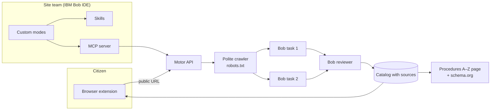

# Wayfinder

**Your government procedure, one click away — built with IBM Bob.**

Wayfinder turns any public website into a guided catalog of the procedures people
actually come to do: what you need, how to do it, and the exact official link to
start. Citizens get a browser extension that walks them through the official
site. The team that maintains the site gets IBM Bob — custom modes, skills and an
MCP server — to build, audit and fix that catalog in minutes instead of days.

- **Live:** https://andromedaweb.store/wayfinder/ · extension ZIP: https://andromedaweb.store/wayfinder/extension/wayfinder-extension.zip
- **Team:** Candela ([@candepilar](https://github.com/candepilar)) and Franco ([@francoledesma12-bit](https://github.com/francoledesma12-bit)) · IBM Bob 2.0 Hackathon (lablab.ai, Sept 2026)

---

## The problem

Public sites bury procedures behind menus that mirror the org chart rather than
what a person needs: nobody searches for *Animal Health* when their neighbour's
dog was abandoned. Wayfinder measures how deep each procedure really is, from the
site's own links. Keeping a
procedures guide up to date is manual work for small web teams: someone has to
crawl the site, copy requirements and links, notice when they change and fix
broken paths. The citizen pays for it in time; the team pays for it in hours.

## What Wayfinder does

| For | What they get | Where |
| --- | --- | --- |
| **Citizens** | A side panel on the official site: search in everyday words, a step-by-step guide that highlights the next link on the page, requirements checklist, "continue where you left off", read-aloud and share-by-WhatsApp. Ask Bob when search is not enough. | [`extension/`](extension/) |
| **Site teams (developers)** | Bob in the IDE builds a catalog of every procedure in parallel, reviews its own work, reports what changed since the last read and **generates the fix**: an accessible "Procedures A–Z" page and schema.org `GovernmentService` data ready to publish on their own site. | [`.bob/`](.bob/), [`motor/`](motor/) |
| **Anyone** | The same catalogs as tools for any agent, through an MCP server. | [`motor/src/mcp.mjs`](motor/src/mcp.mjs) |

## How IBM Bob is used

Bob is not only how we wrote the code — it does real work inside the product.

| Bob feature | What it does in Wayfinder | Code |
| --- | --- | --- |
| **Parallel tasks** | A site's pages are split into batches; each batch is a separate Bob task, run concurrently. Progress is visible per task, and results appear progressively as each task finishes. | [`catalogo.mjs`](motor/src/catalogo.mjs) |
| **Multi-step agent work** | A second Bob pass acts as **reviewer**: it checks every fiche against its source page and marks it *confirmed* or *needs review* with a reason. | [`catalogo.mjs`](motor/src/catalogo.mjs) |
| **Document understanding** | Bob selects literal blocks and links from the pages (never rewrites them) and writes how a neighbour would ask for each procedure, so instant search understands everyday words without calling a model per query. | [`catalogo.mjs`](motor/src/catalogo.mjs) |
| **Conversational guide** | Bob chooses the right fiche from the catalog, asks one clarifying question when the request is ambiguous, and cites its sources. | [`asistente.mjs`](motor/src/asistente.mjs) |
| **Custom modes** | 🧭 *Catalog coordinator* (fans sites out to parallel subtasks), 🗺️ *Cartographer* (builds and audits one catalog), 🔎 *Technical reviewer* (passive diagnosis, no patches). | [`.bob/custom_modes.yaml`](.bob/custom_modes.yaml) |
| **Skills** | `auditar-catalogo` (verifiable numbers, before/after comparison) and `medir-impacto` (benchmark recipe). | [`.bob/skills/`](.bob/skills/) |
| **MCP** | `wayfinder` server: `listar_sitios`, `buscar_gestion`, `ver_ficha`, `ver_cambios`, `generar_indice`, `auditar_catalogo`. | [`.bob/mcp.json`](.bob/mcp.json), [`mcp.mjs`](motor/src/mcp.mjs) |
| **Rules** | Untrusted-content handling, no invented data, reserved files, team handoff protocol. | [`.bob/rules/`](.bob/rules/) |

The team also coordinated two AI assistants through a shared handoff log
([`BUZON.md`](BUZON.md)), and prepared a bilingual procedure dataset for IBM
Granite retrieval experiments ([`entrenamiento/`](entrenamiento/)).

## Measured results

Every number below is reproducible from this repository; limits are stated next to it.

| What | Result | Source / limits |
| --- | --- | --- |
| Clicks from the home page to a procedure | Computed per fiche from the site's real link graph (shortest path); Wayfinder puts it one click away | `catalogo.impacto`; a lower bound — the real path can only be longer |
| Instant search (no model, in the browser) vs. BM25 | **Top-1 69.6 % vs 66.3 %**, **top-3 80.4 % vs 77.2 %** | 92 Spanish validation queries over 3,512 documents; synthetic queries by Bob — [`docs/evidencia/busqueda/`](docs/evidencia/busqueda/) |
| Time to first result on a new site | **3.4 s** (first procedures visible) vs **10.4 s** (full catalog, reviewed) | Local test site with 16 procedures and a simulated Bob; real Bob tasks take longer, so the gap grows |
| Repeated question to the assistant | ~**3.4 s → 0.1 s** (answer from cache, no new Bob call) | Same local setup; real Bob answers took 9–15 s in production samples |
| Real Bob runs | Catalogs for La Económica (40 pages read) and GOV.UK; assistant answers in production for Rosario, Villa Gobernador Gálvez and La Económica | Task IDs and timings logged in [`BUZON.md`](BUZON.md) |

## Trust and safety by design

- **Nothing invented.** Bob can only select block and link IDs that exist in the
  pages read; the text shown is the site's own. Numbers the assistant mentions must
  appear in the cited blocks.
- **Untrusted content.** Page text is treated as data, never as instructions.
  Exported pages escape everything and only accept `http(s)` links; downloads are
  served with a restrictive CSP.
- **No personal data.** Wayfinder never fills or submits forms and never asks for
  IDs or passwords. Links on the open tab are processed locally in the browser.
- **Honest coverage.** Partial reads, omissions and fiches Bob flagged for review
  are shown, not hidden.

## Architecture



## Try it

**Extension (Chrome, Brave or Edge 116+):** download the ZIP above, unzip it, open
`chrome://extensions`, enable *Developer mode*, choose *Load unpacked* and select the
folder that contains `manifest.json`. Open a public site and click the Wayfinder icon.

**Bob IDE:** open this repository in IBM Bob. The three modes, two skills, rules and
the `wayfinder` MCP server load from [`.bob/`](.bob/). A guided session is in
[`.bob/README.md`](.bob/README.md).

**Run locally:**

```sh
cd motor && npm ci && npm test          # 72 tests
node --test extension/test.mjs           # from the repo root
cd motor && node src/server.mjs          # API on :3101 (Bob needs BOB_ENTRY and BOB_API_KEY in motor/.env)
```

## Repository map

| Path | Contents |
| --- | --- |
| [`extension/`](extension/) | Browser extension (side panel, guide, search, Bob chat) |
| [`motor/`](motor/) | Crawler, catalog with Bob, assistant, export, MCP server, API |
| [`.bob/`](.bob/) | IBM Bob custom modes, skills, rules and MCP registration |
| [`visor/`](visor/) | Web front end |
| [`docs/evidencia/`](docs/evidencia/) | Reproducible evidence and screenshots |
| [`entrenamiento/`](entrenamiento/) | Bilingual procedure dataset and Granite experiments (not in production) |
| [`BUZON.md`](BUZON.md) | Handoff log between the two AI assistants and the team |

## Limitations

Wayfinder reads public HTML: sites that require login or render everything with
JavaScript can yield partial catalogs (the extension can still find links on the
rendered page). A catalog reflects the date it was read, not a guarantee that a
procedure is current. Wayfinder guides; the citizen completes the procedure on the
official site.
