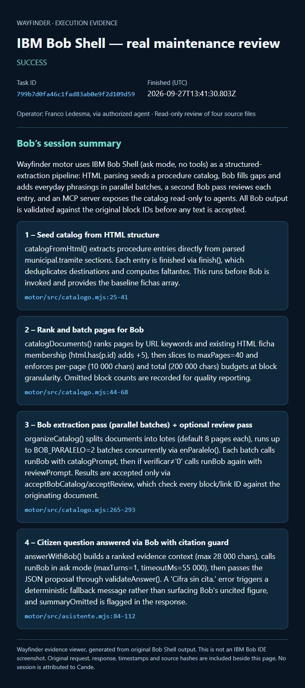
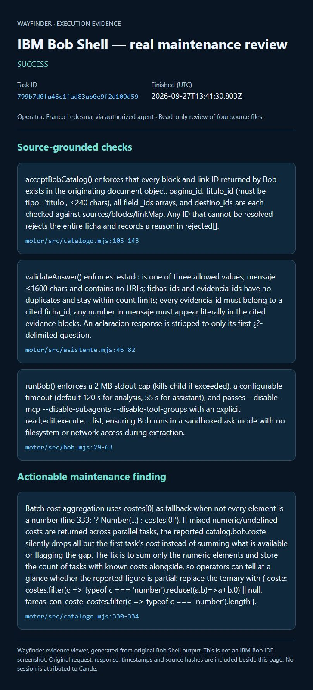

# IBM Bob task session — Franco Ledesma

Real IBM Bob Shell maintenance review, executed on 2026-09-27 through Wayfinder's runBob integration.

- Task ID: `799b7d0fa46c1fad83ab0e9f2d109d59`
- Status: success; duration reported by Bob: 32,142 ms.
- Operator: Franco Ledesma via authorized agent.
- Scope: read-only review of four actual project source files; no tool calls or source edits in this task.

## Session summary screenshots

These are browser screenshots of a Wayfinder evidence viewer rendering the original Bob Shell response, not screenshots of Bob IDE. The original request, source hashes, timestamps and response are included in request.json and result.json; review.json is the parsed response. No session is attributed to Cande.

Bob identified catalog construction, evidence checks, assistant citation checks and a suggested improvement to partial cost aggregation. This suggestion is not claimed as implemented. This review is source analysis, not a runtime test or security certification. In particular, the response's reference to a sandbox must be read as disabled general-purpose tools: this does not establish OS isolation or absence of network access.

Reproduction: from motor/, with an independently configured .env, run `node --env-file=.env evidence-session.mjs`. This makes a paid Bob call and overwrites the evidence files; preserve this recorded session first. Credentials are not included.
